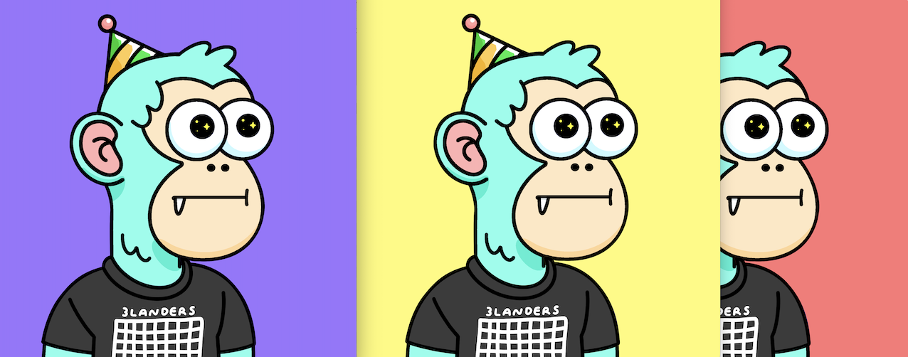

3lander NFT on Near blockchain
===================

This repository is meant to be applied for [ncd] certification. I used [nft-example] repository as a base for this project.

Smart contract that allows to mint 1 of 1 art NFT and gives the ability to the owner to determine the piece's color.
There are 3 variations of the work. The owner will determine which of the 3 is displayed.

The idea was inspired by [ngmi] NFT by XCOPY.
The image itself I got from one of the 3landers NFTs [3landers-5169]. Just because it looks funny



  [nft-example]: https://github.com/near-examples/NFT
  [ncd]: https://www.near.university/courses/near-certified-developerT
  [ngmi]: https://www.sothebys.com/en/buy/auction/2021/natively-digital-a-curated-nft-sale-2/ngmi
  [3landers-5169]: https://opensea.io/assets/ethereum/0xb4d06d46a8285f4ec79fd294f78a881799d8ced9/5169
Prerequisites
=============

  * Make sure Rust is installed per the prerequisites in [`near-sdk-rs`](https://github.com/near/near-sdk-rs).
  * Make sure [near-cli](https://github.com/near/near-cli) is installed.

Explore this contract
=====================

The source for this contract is in `contract/src/lib.rs`. It provides methods to mint and change color methods, as well as other NFT related methods from near-sdk.

Building this contract
======================
Run the following, and we'll build our rust project up via cargo. This will generate our WASM binaries into our `res/` directory. This is the smart contract we'll be deploying onto the NEAR blockchain later.
```bash
cd contract
./build.sh
```

Testing this contract
=====================
We have some tests that you can run. For example, the following will run tests to verify that our contract code is working.

*Unit Tests*
```bash
cargo test -- --nocapture
```

Using this contract
===================

This smart contract will get deployed to your NEAR account. For this example, please create a new NEAR account. Because NEAR allows the ability to upgrade contracts on the same account, initialization functions must be cleared. If you'd like to run this example on a NEAR account that has had prior contracts deployed, please use the `near-cli` command `near delete`, and then recreate it in Wallet. To create (or recreate) an account, please follow the directions in [Test Wallet](https://wallet.testnet.near.org) or ([NEAR Wallet](https://wallet.near.org/) if we're using `mainnet`).

In the project root, log in to your newly created account with `near-cli` by following the instructions after this command.

    near login

OR create new account. (Add your account name)

    near create-account lander.example.near --masterAccount example.testnet

To make this tutorial easier to copy/paste, we're going to set an environment variable for our account id. In the below command, replace `MY_ACCOUNT_NAME` with the account name we just logged in with, including the `.testnet` (or `.near` for `mainnet`):

    ID=MY_ACCOUNT_NAME

We can tell if the environment variable is set correctly if our command line prints the account name after this command:

    echo $ID

Now we can deploy the compiled contract in this example to your account:

    near deploy --wasmFile res/lander_near_nft_ncd.wasm --accountId $ID

NFT contract should be initialized before usage. More info about the metadata at [nomicon.io](https://nomicon.io/Standards/NonFungibleToken/Metadata.html). But for now, we'll initialize with the default metadata.

    near call $ID new_default_meta '{"owner_id": "'$ID'"}' --accountId $ID

We'll be able to view our metadata right after:

    near view $ID nft_metadata

Then, let's mint our first token. This will create a NFT  where only one copy exists:

    near call $ID nft_mint '{"token_id": "0", "receiver_id": "'$ID'", "token_metadata": { "title": "Lander", "description": "3landers", "media": "https://bafybeihgivtoptr34zxvnf6xvvkvontr23ohtkqk52nfazb2a7hj4wlqxq.ipfs.dweb.link/purple-3lander-nft.png", "media_hash": "N2Y4OWY0ZTdlMGQ4ZThmNTU5NWI0MTM0ZDNkNDc1MzMxMWM3NDhhZTJkZmU2NWJkM2I5YzRmMmFjNzEyYmM1Yw==", "copies": 1}}' --accountId $ID --deposit 0.1

Check the token

    near view $ID nft_token '{"token_id": "0"}' --accountId $ID

Changing the color of the artwork
====================

Default color is purple. Available colors are purple, yellow and red. 

    near call $ID change_color '{"token_id": "0", "color": "Yellow"}' --accountId $ID
    near call $ID change_color '{"token_id": "0", "color": "Red"}' --accountId $ID
    near call $ID change_color '{"token_id": "0", "color": "Purple"}' --accountId $ID

Check that media was changed

    near view $ID nft_token '{"token_id": "0"}' --accountId $ID


Transferring our NFT
====================

Let's set up an account to transfer our freshly minted token to. This account will be a sub-account of the NEAR account we logged in with originally via `near login`.

    near create-account alice.$ID --masterAccount $ID --initialBalance 10

Checking Alice's account for tokens:

    near view $ID nft_tokens_for_owner '{"account_id": "'alice.$ID'"}'

Then we'll transfer over the NFT into Alice's account. Exactly 1 yoctoNEAR of deposit should be attached:

    near call $ID nft_transfer '{"token_id": "0", "receiver_id": "alice.'$ID'", "memo": "transfer ownership"}' --accountId $ID --depositYocto 1

Checking Alice's account again shows us that she has the 3landers near token.
